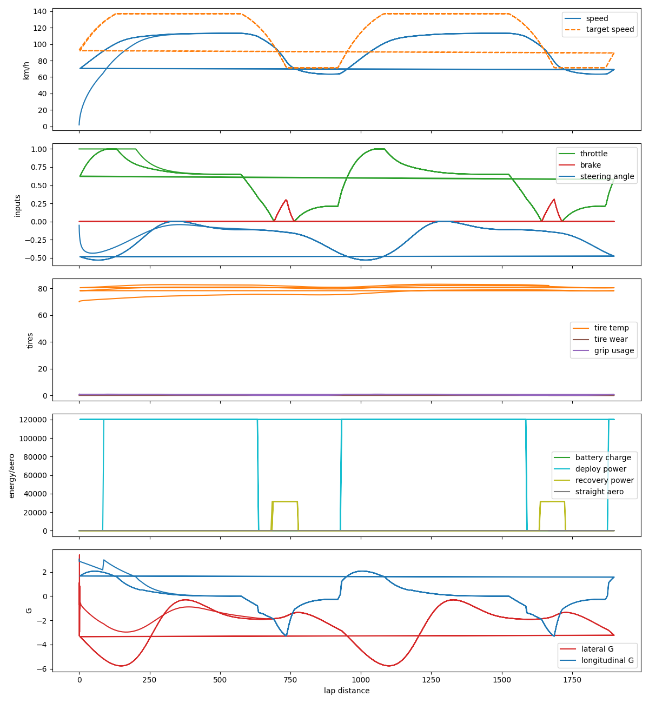

# ApexDriveLab Final Demo Report

## Modeled Physics

- 2D bicycle-model vehicle dynamics with front/rear axle slip angles.
- Tire friction circle, basic load transfer, tire temperature, and tire wear.
- Aerodynamic drag and downforce with front/rear aero balance.
- Active aero modes for corner and straight behavior.
- Hybrid energy store with deployment and regenerative recovery.

## AI Controls

- Pure-pursuit steering follows a racing line target ahead of the car.
- Speed planning estimates upcoming curvature and commands throttle/brake.
- The rule driver selects active aero mode and hybrid deployment.
- Random search tunes lookahead, speed, braking, aero, and hybrid thresholds.

## Experiments

| Category | Name | Laps | Best Lap | Avg Lap | Off Track | Max Grip | Cond Grip | Tire Temp | Tire Wear | Score |
|---|---|---:|---:|---:|---:|---:|---:|---:|---:|---:|
| aero_setup | high_downforce | 3 | 7.683 | 8.200 | 0.000% | 1.000 | 0.999 | 75.90 | 0.0022 | 8.683 |
| aero_setup | low_drag | 3 | 7.667 | 8.183 | 0.000% | 1.000 | 0.999 | 75.96 | 0.0022 | 8.667 |
| aero_balance | front_biased | 3 | 7.667 | 8.183 | 0.000% | 1.000 | 0.999 | 75.96 | 0.0022 | 8.667 |
| aero_balance | rear_biased | 3 | 7.683 | 8.189 | 0.000% | 1.000 | 0.999 | 75.92 | 0.0022 | 8.683 |
| energy | conservative_energy | 3 | 7.983 | 8.506 | 0.000% | 1.000 | 0.999 | 75.11 | 0.0019 | 8.983 |
| energy | aggressive_energy | 3 | 7.583 | 8.094 | 0.000% | 1.000 | 0.999 | 76.27 | 0.0023 | 8.583 |
| tires | fresh_tires | 3 | 7.683 | 8.194 | 0.000% | 1.000 | 0.999 | 80.82 | 0.0022 | 8.683 |
| tires | worn_tires | 3 | 7.683 | 8.194 | 0.000% | 1.000 | 0.657 | 86.72 | 0.5550 | 8.683 |
| tires | cold_tires | 3 | 7.683 | 8.194 | 0.000% | 1.000 | 0.945 | 71.52 | 0.0026 | 8.683 |
| tires | ideal_tires | 3 | 7.683 | 8.194 | 0.000% | 1.000 | 0.999 | 80.82 | 0.0022 | 8.683 |
| track | dry_track | 3 | 7.683 | 8.194 | 0.000% | 1.000 | 0.999 | 75.93 | 0.0022 | 8.683 |
| track | wet_track | 3 | 9.250 | 9.922 | 0.000% | 1.000 | 0.998 | 81.83 | 0.0059 | 10.250 |
| ai | rule_based_default | 3 | 7.683 | 8.194 | 0.000% | 1.000 | 0.999 | 75.93 | 0.0022 | 8.683 |
| ai | optimized_rule_based | 3 | 6.633 | 6.956 | 0.000% | 1.000 | 0.999 | 79.54 | 0.0034 | 7.633 |

## Results Found

- The optimized rule-based AI is faster than the default rule-based AI in the current simplified simulator.
- Hybrid deployment improves lap time compared with conservative or disabled deployment.
- Low-drag and front-aero configurations are slightly faster on this oval-style test track.
- Cold, worn, and wet-condition tests provide repeatable scenarios for tire and grip sensitivity.
- Grip saturation is still frequent, so future work should tune tire limits and target-speed planning for more realism.

## Telemetry Dashboard

## Video Notes

A short demo video can be recorded from the Pygame window by running the simulator, pressing `P` for AI mode, and showing the generated telemetry dashboard/report afterward.
