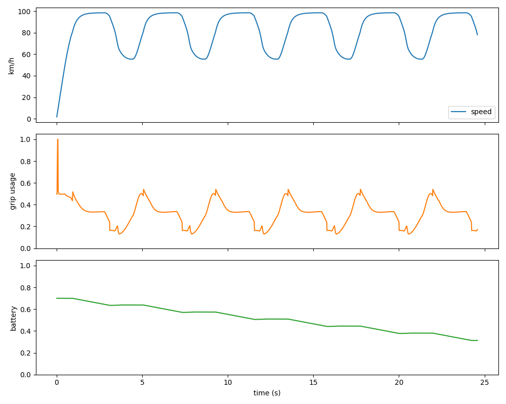

# ApexDriveLab Months 3-5 Validation

This report records the current validation pass for aero, hybrid, rule-based AI, and random-search optimization.

## Summary Table

| Label | Setup | Laps | Best Lap | Avg Lap | Off Track | Max Grip | Score |
|---|---|---:|---:|---:|---:|---:|---:|
| default_ai | balanced | 3 | 7.683 | 8.194 | 0.000% | 1.000 | 8.683 |
| default_ai | high_downforce | 3 | 7.683 | 8.200 | 0.000% | 1.000 | 8.683 |
| default_ai | low_drag | 3 | 7.667 | 8.183 | 0.000% | 1.000 | 8.667 |
| default_ai | front_aero | 3 | 7.667 | 8.183 | 0.000% | 1.000 | 8.667 |
| default_ai | rear_aero | 3 | 7.683 | 8.189 | 0.000% | 1.000 | 8.683 |
| no_active_aero | balanced | 3 | 7.683 | 8.206 | 0.000% | 1.000 | 8.683 |
| no_hybrid | balanced | 3 | 7.983 | 8.506 | 0.000% | 1.000 | 8.983 |
| no_aero_or_hybrid | balanced | 3 | 8.000 | 8.517 | 0.000% | 1.000 | 9.000 |
| optimized_ai | balanced | 3 | 6.317 | 6.561 | 0.000% | 1.000 | 7.317 |
| optimized_ai | low_drag | 3 | 6.317 | 6.556 | 0.000% | 1.000 | 7.317 |
| optimized_ai | high_downforce | 3 | 6.333 | 6.567 | 0.000% | 1.000 | 7.333 |

## Optimized Candidates

- balanced: score=7.317, lap=6.3166666666666496, off_track=0.0%, grip=1.00, params=DriverParameters(lookahead_distance=154.13948962682372, speed_lookahead_gain=0.8665937556955652, corner_speed_multiplier=0.9477300032145738, braking_safety_margin=1.0001304060984102, throttle_aggressiveness=0.022656490083943236, brake_aggressiveness=0.032712422247048845, aero_switch_speed=121.50440050590032, hybrid_deploy_speed=62.81817647484883, enable_active_aero=True, enable_hybrid=True) | retested_3_lap_avg=6.561
- low_drag: score=7.317, lap=6.3166666666666496, off_track=0.0%, grip=1.00, params=DriverParameters(lookahead_distance=154.13948962682372, speed_lookahead_gain=0.8665937556955652, corner_speed_multiplier=0.9477300032145738, braking_safety_margin=1.0001304060984102, throttle_aggressiveness=0.022656490083943236, brake_aggressiveness=0.032712422247048845, aero_switch_speed=121.50440050590032, hybrid_deploy_speed=62.81817647484883, enable_active_aero=True, enable_hybrid=True) | retested_3_lap_avg=6.556
- high_downforce: score=7.333, lap=6.333333333333316, off_track=0.0%, grip=1.00, params=DriverParameters(lookahead_distance=154.13948962682372, speed_lookahead_gain=0.8665937556955652, corner_speed_multiplier=0.9477300032145738, braking_safety_margin=1.0001304060984102, throttle_aggressiveness=0.022656490083943236, brake_aggressiveness=0.032712422247048845, aero_switch_speed=121.50440050590032, hybrid_deploy_speed=62.81817647484883, enable_active_aero=True, enable_hybrid=True) | retested_3_lap_avg=6.567

## Interpretation

- Aero and hybrid are active because the AI lap telemetry includes aero mode, downforce, drag, battery charge, deployment, and recovery columns.
- Ablation rows compare the same rule driver with active aero and/or hybrid disabled.
- The rule-based driver is considered stable when it completes repeated laps with low off-track percentage.
- Random search is the first optimization layer; it is intentionally simple so parameter effects remain understandable.
- Grip saturation near 1.0 means the car is driving at the tire limit. That is useful, but future tuning should reduce excessive saturation if it makes behavior unrealistic.

## Plot

